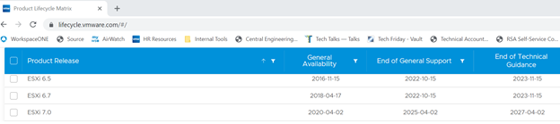

# vSphere-67-Upgrade-to-7u3

Tips, tricks, gotchas and important dates collected by a friendly VMware TAM

## vSphere 7 ushers in a new era

vSphere 7 has lots of new capabilities. This link is the best to see them all listed and find technical information on each  
https://blogs.vmware.com/vsphere/vsphere-7   

There is also a blog post highlighting the new vSphere 7u3 features:  
https://core.vmware.com/blog/vsphere-7-update-3-whats-new  

vCenter 7.x is only available as an appliance:  
https://blogs.vmware.com/vsphere/2017/08/farewell-vcenter-server-windows.html  

vSphere 7u3c should be the minimum version to upgrade to, as it solves Log4J vulnerabilities  
https://blogs.vmware.com/vsphere/2022/01/announcing-availability-of-vsphere-7-update-3c.html  

### TAM customer webinars  

TAM Customer Webinar detailing v7 storage changes  
https://www.youtube.com/watch?v=CXHxsrL5KKg&list=PLXw1EF8ZER1i0hKUm2OaUp7xTYdp504cA&index=1  

TAM Customer Webinar detailing vSphere 7  
https://www.youtube.com/watch?v=OVN9nNtjJwI  

TAM Lab vSphere 7.x Planning and Upgrade  
https://www.youtube.com/watch?v=yTmR7Rucz5Q&t=185s   

### Known issues in 7u3
There are some known issues with vSphere 7u3. For example, if you have VMs with more than 8TB of RAM, as is customary with in-memory databases like SAP HANA, you may need to follow the workaround listed here https://blogs.vmware.com/apps/2022/02/sap_hana_vsphere70u3c_and_cooper_lake_8s_support.html  

A complete list of known issues is included and updated in the release notes and in this KB “Important list of Knowledge base articles identified for vSphere 7.0 U3c release”  
https://kb.vmware.com/s/article/87327   

## Important dates:
As of 3/9/22, ESXi 6.5 and 6.7 show their End of General Support (EOGS) on 10/15/22 (vCenter has the same dates):  
https://lifecycle.vmware.com/  

  
 
What does End of General Support mean?  
https://www.vmware.com/support/policies.html#lifecyclepolicies  

!(general support explanation)[images/general%20support%20explanation.png]  
(image 3)[url3]  
